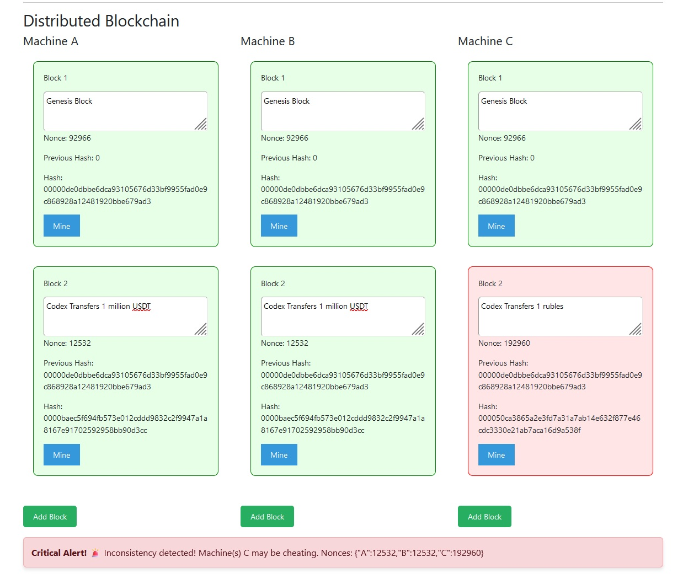

# Blockchain-demo

Welcome to the Blockchain Simulator project! This project showcases a simple implementation of a blockchain using React and Vite, highlighting concepts like block mining, hashing with SHA256, and a distributed blockchain simulation.  
While there are other projects with similar ideas, this one specifically includes a **validator node** that validates the blocks before mining to prevent manipulation by miners.  
This project was created specifically for NSTU University, as part of the Control Systems subject, to simulate the nature of a system.

## Features

- **Block Mining**: Demonstrates the mining process using a nonce, where valid blocks must produce a hash starting with "0000".
- **Blockchain Management**: State management for handling multiple blocks in a blockchain.
- **Distributed Architecture**: Simulates multiple machines ("A", "B", "C") with their own blockchain instances to demonstrate consensus.
- **Hash Calculator**: A simple tool that takes user input and computes the SHA256 hash.
- **Notifications for Inconsistencies**: Alerts the user when inconsistencies are detected between different blockchains.

## Table of Contents

- [Technologies Used](#technologies-used)
- [Installation](#installation)
- [Usage](#usage)
- [Components](#components)
- [License](#license)

## Technologies Used

- **React.js** - A JavaScript library for building user interfaces.
- **Vite** - A modern build tool for faster development.
- **Crypto.js** - A JavaScript library to perform cryptographic operations, including SHA256 hashing.
- **React Toastify** - A library for toast notifications in React.

## Installation

To get started with the project, follow these steps:

1. **Clone the repository**:
   ```bash
   git clone https://github.com/codex32byte/Blockchain-demo.git
  
   
2. **Install dependencies**:
   ```bash
   cd Blockchain-demo
   
   npm install
    
3. **Run the development server**:
    ```bash
   npm run dev

4. **Open your browser and navigate to**:
    
    http://localhost:3000 (or the port specified in the terminal) to view the application.


 ## Usage

  - **Hash Calculator**: Input data in the "Data" textarea and see the SHA256 hash calculated in real-time.

  - **Block Mining**: Add new blocks and input data to simulate the mining process. Click "Mine" to initiate mining, which will display the generated nonce and hash.

  - **Distributed Blockchain**: Explore the blockchains for machines A, B, and C. Each machine displays its own blockchain, and you can verify the consistency of blocks across different machines. Alerts will show any inconsistencies found.

## Components


 - **App**: The main component that organizes the application structure. It includes all major components.
 - **HashCalculator**: Allows users to input data and see the corresponding SHA256 hash.
 - **Blockchain**: Manages a specific blockchain consisting of multiple blocks.
 - **Block**: Represents an individual block, allows data updates, and facilitates the mining process.
 - **DistributedBlockchain**: Houses multiple instances of the Blockchain component and manages their consistency.
 - **useValidator**: A custom hook for validating blocks across different blockchains and updating the highlighted states based on validity.

   
## License
This project is licensed under the MIT License - see the LICENSE.md file for details. 
